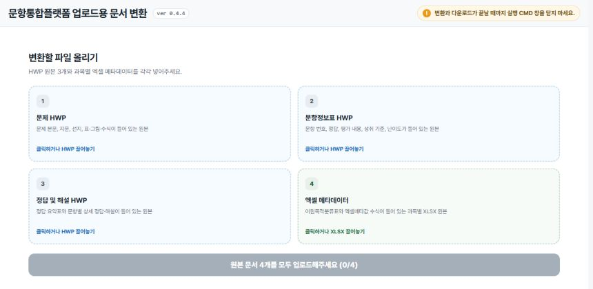
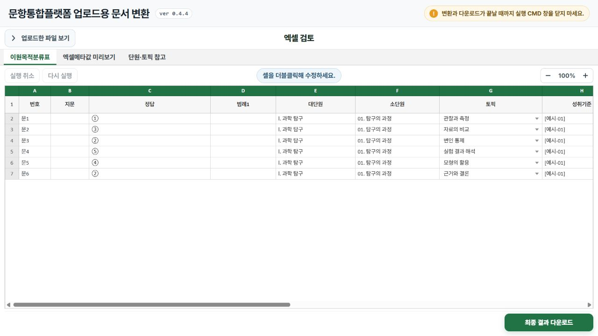
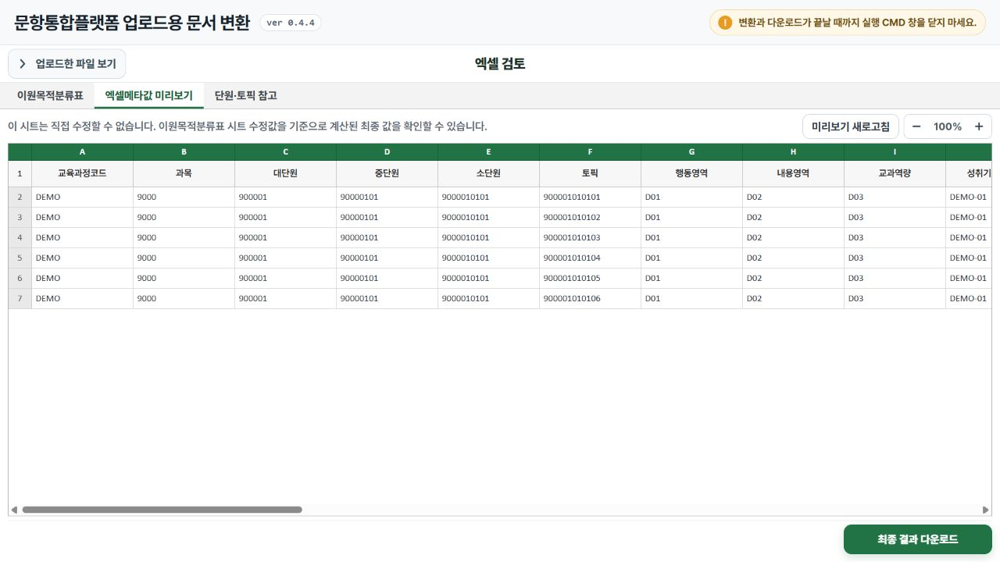

# HWP 문항 문서 변환 자동화

**문서마다 반복하던 편집과 Excel 입력을, 업로드 한 번으로.**

문제·정답·해설이 담긴 HWP 문서를 읽어 교육 플랫폼에 업로드할 HML·Excel 파일로 바꾸는 로컬 프로그램입니다. 변환 후에는 웹 화면에서 내용을 검토·수정하고 결과를 내려받을 수 있습니다.

## 이렇게 사용합니다

### 1. 원본 파일 넣기

문제·문항정보표·정답 및 해설과 Excel 양식을 선택하면 변환을 시작합니다.

### 2. 변환된 내용 확인하기

문항 정보를 표에서 바로 수정합니다. 토픽을 선택하면 연결된 단원 정보도 자동으로 채워집니다.

### 3. 최종 파일 내려받기

업로드에 필요한 값을 미리 확인하고, 최종 HML·Excel 파일을 내려받습니다.

*화면은 실제 프로그램 UI이며, 표시된 문항·단원·코드는 공개용 가상 데이터입니다.*

## 구현 포인트

- **수작업 줄이기:** 문서에서 문항 정보를 추출하고 Excel 양식에 자동 입력
- **원본 내용 보존:** 표·그림·수식을 처리하고, 문서마다 다른 형식의 예외를 보정
- **검토까지 연결:** 편집·자동 채움·미리보기·다운로드를 하나의 흐름으로 구성

**검증:** 내부 예제 740문항과 자동 테스트 131개로 변환·편집 기능을 점검했습니다.

**기술:** Python · JavaScript · HTML/CSS · XML · openpyxl

---

포트폴리오용 소개와 화면만 공개합니다. 운영 코드와 업무용 원본 자료는 포함하지 않습니다.
